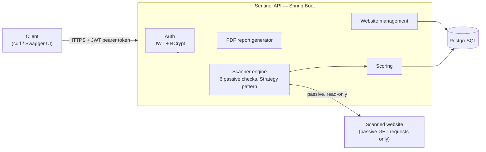

# Sentinel

[](https://github.com/ZukoG/sentinel-secscan/actions/workflows/ci.yml)
[](LICENSE)

Sentinel is a passive web security assessment platform. Give it a URL,
it checks HTTPS usage, security headers, SSL/TLS certificate status,
HSTS, cookie flags, and redirect behavior, the same way a normal
browser visit would, scores what it finds, and generates a PDF report.

**No active attacks, exploitation, brute force, or fuzzing, ever.** This
is a permanent design constraint, not a v1 limitation, see NFR-1 in
[`docs/SRS.md`](docs/SRS.md).

Built as a combined submission for two university electives:
Cybersecurity (primary) and Cloud Computing (secondary). See
[`docs/SRS.md`](docs/SRS.md) section 1.2 for how the work maps to each.

## Why it matters

Most "is my site secure" checks people run are either a paid SaaS
product or a single-purpose script. Sentinel is neither: it's a small,
fully-owned system that shows the whole path from requirement to
running code, requirements spec, threat model, architecture decisions,
tested passive checks, async orchestration, a scored risk rating, a
generated report, and the infrastructure (documentation-grade, honestly
labeled as such) to run it in the cloud. Every design decision that
deviates from an obvious default is written down as an ADR
([`docs/adr/`](docs/adr)) or in the threat model
([`docs/THREAT_MODEL.md`](docs/THREAT_MODEL.md)), not just implemented
silently.

## Architecture



Full component, data model, and sequence diagrams live on the
[project wiki's Architecture page](https://github.com/ZukoG/sentinel-secscan/wiki/Architecture).
The target cloud deployment (Terraform, Kubernetes, what's live versus
documentation-grade) is in
[`docs/CLOUD_ARCHITECTURE.md`](docs/CLOUD_ARCHITECTURE.md).

## Quick start

```bash
git clone https://github.com/ZukoG/sentinel-secscan.git
cd sentinel-secscan
docker compose -f infra/docker-compose.yml up --build
```

That's the whole process, no local JDK, Maven, or Postgres install
needed, and no manual setup beyond this command (NFR-7 in
[`docs/SRS.md`](docs/SRS.md)). Full steps, including a target cloud
deployment, are in [`docs/DEPLOYMENT.md`](docs/DEPLOYMENT.md).

Once it's up, Swagger UI is at `http://localhost:8080/swagger-ui/index.html`,
generated straight from the real controllers (Day 17), no
hand-maintained API spec to drift out of sync.

## A real walkthrough

Captured directly from a running instance, not a mock-up. Register,
trigger a scan against `https://example.com`, and see it complete:

```
$ curl -X POST localhost:8080/api/auth/register -d '{"email":"you@example.com","password":"..."}'
201

$ curl -X POST localhost:8080/api/auth/login -d '{"email":"you@example.com","password":"..."}'
{"token": "eyJhbGciOiJIUzI1NiJ9..."}

$ curl -X POST localhost:8080/api/websites -H "Authorization: Bearer $TOKEN" -d '{"url":"https://example.com"}'
{"id":1,"url":"https://example.com","addedAt":"2026-08-21T10:40:13Z"}

$ curl -X POST localhost:8080/api/websites/1/scans -H "Authorization: Bearer $TOKEN"
{"id":1,"status":"IN_PROGRESS", ...}

$ curl localhost:8080/api/scans/1 -H "Authorization: Bearer $TOKEN"
{
  "status": "COMPLETED",
  "overallScore": 50,
  "riskRating": "HIGH",
  "findings": [
    {"checkName": "hsts", "severity": "HIGH",
     "description": "Strict-Transport-Security header is missing."},
    {"checkName": "security-headers", "severity": "HIGH",
     "description": "Content-Security-Policy is missing. ..."},
    {"checkName": "https-usage", "severity": "INFO",
     "description": "Website is served over HTTPS."},
    {"checkName": "ssl-certificate", "severity": "INFO",
     "description": "Certificate is valid until 2026-10-27T22:17:21Z, issued by CN=Cloudflare TLS Issuing ECC CA 3,O=SSL Corporation,C=US."},
    {"checkName": "cookie-security", "severity": "INFO",
     "description": "The site does not set any cookies."},
    {"checkName": "redirect-analysis", "severity": "INFO",
     "description": "No redirects occurred."}
  ]
}

$ curl localhost:8080/api/scans/1/report -H "Authorization: Bearer $TOKEN" -o report.pdf
# a real PDF: score, risk rating, and every finding above with a recommendation
```

(Screenshots of Swagger UI and the rendered PDF weren't captured for
this rewrite, the environment used to write this couldn't render a
browser pane. The transcript above is real, captured output from a
running instance, not a placeholder, adding actual screenshots later
is a fine, low-effort follow-up.)

## Tech stack

- **Backend:** Java 25, Spring Boot, Spring Security, Spring Data JPA, Hibernate, Maven
- **Database:** PostgreSQL, schema managed with Flyway migrations
- **Auth:** JWT (jjwt) + BCrypt, stateless (see [ADR 0003](docs/adr/0003-jwt-over-server-side-sessions.md))
- **API docs:** springdoc-openapi, OpenAPI 3 + Swagger UI generated from the real controllers
- **PDF reports:** Apache PDFBox
- **CI/CD:** GitHub Actions, build+test, CodeQL (SAST), Trivy (dependency scanning)
- **Infrastructure:** Docker Compose (live, local dev), Terraform + Kubernetes (documentation-grade, see [`infra/README.md`](infra/README.md))

## Documentation

- [`docs/SRS.md`](docs/SRS.md): Software Requirements Specification, the source of truth for scope and requirements.
- [`docs/THREAT_MODEL.md`](docs/THREAT_MODEL.md): STRIDE threat model against the real, as-built architecture.
- [`docs/adr/`](docs/adr): Architecture Decision Records, why key technical choices were made, not just what they are.
- [`docs/CLOUD_ARCHITECTURE.md`](docs/CLOUD_ARCHITECTURE.md): target cloud architecture, and what's actually live versus documentation-grade.
- [`docs/DEPLOYMENT.md`](docs/DEPLOYMENT.md): deployment steps for both local and cloud modes, plus real smoke test results.
- [`docs/MONITORING.md`](docs/MONITORING.md): what observability exists today versus what a real deployment still needs.
- [`docs/ROADMAP.md`](docs/ROADMAP.md): what v1.0.0 ships, and what's prioritized next.
- [`docs/DEMO_SCRIPT.md`](docs/DEMO_SCRIPT.md): the script used for this project's demo recording.
- [`infra/README.md`](infra/README.md): what's actually running locally versus documentation-grade only.
- [Project wiki](https://github.com/ZukoG/sentinel-secscan/wiki): full architecture diagrams, requirements summary, build plan, and contributing conventions.

## License

[MIT](LICENSE)
