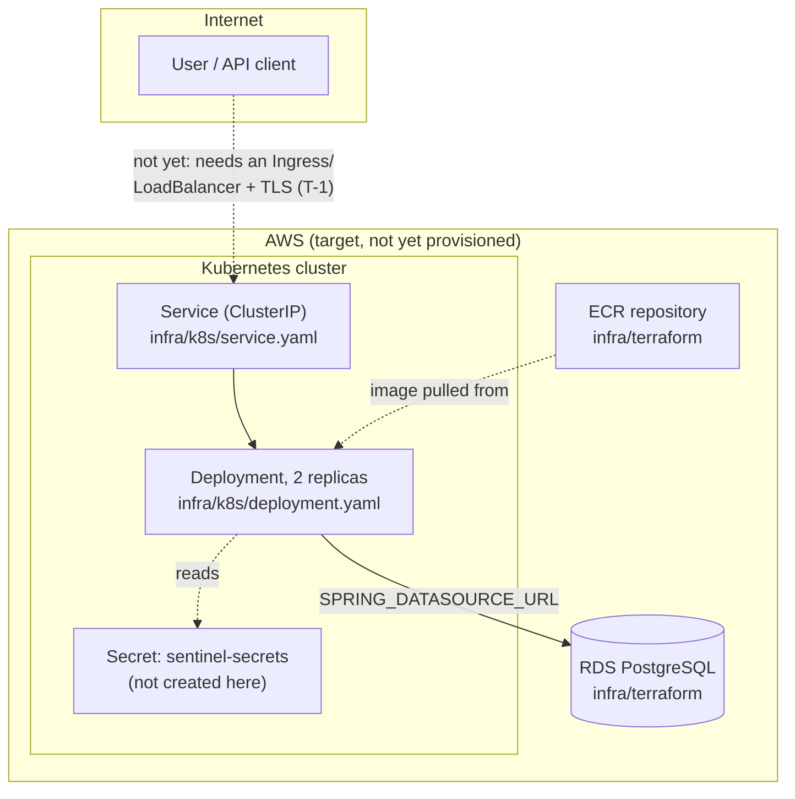

# Sentinel Cloud Architecture

**Status:** v1.0.0, written Day 19
**Scope:** the target cloud deployment architecture for Sentinel, what is
actually running today versus what is documentation-grade only, and how
the pieces (Docker, CI/CD, Terraform, Kubernetes) fit together. Written
to stand on its own for the Cloud Computing elective, independently of
`backend/`-side detail, per the split `README.md` and the project wiki
already describe.

## 1. Two deployment modes, stated plainly

Sentinel exists in two different deployment states right now, and this
document is explicit about which is which rather than blurring them
together:

| | Local development | Target cloud deployment |
|---|---|---|
| Status | **Live, fully verified** | **Documentation-grade, not applied** |
| Compute | `docker compose` (2 containers) | Kubernetes (`infra/k8s/`) |
| Database | Postgres 16 in a container | RDS PostgreSQL (`infra/terraform/`) |
| Image registry | Local Docker build cache | ECR (`infra/terraform/`) |
| TLS | None (plain HTTP, port 8080) | Not yet designed (finding T-1, `docs/THREAT_MODEL.md`) |
| Verification | Re-run and confirmed working after every day's changes | `terraform validate` and PyYAML structural checks only, no live apply |

Everything in the left column has been exercised for real, repeatedly,
throughout this project (see `CLAUDE.md`'s day-by-day log if you have
access to it, or the PR history for the manual verification notes on
every merged PR). Everything in the right column is real, valid
configuration that has never been pointed at an actual AWS account or
cluster. `infra/README.md` says this too; this document explains the
architecture those files describe, not just that they exist.

## 2. Target architecture

The dotted lines mark what does not exist yet: no Ingress or load
balancer sits in front of the Service (Section 1's TLS row), and no CI
step builds and pushes to ECR or applies the Kubernetes manifests. This
diagram is the target shape, not a claim that traffic can reach it
today.

## 3. Why Kubernetes and Terraform are split into two concerns

`infra/terraform/` provisions **cloud resources**: the ECR repository
and the RDS instance, both of which exist independently of whatever
compute later runs the application. `infra/k8s/` describes the
**workload**: how the application container itself runs, how many
replicas, what it needs from its environment. Splitting these lets
either be swapped without touching the other, the workload manifests
would apply equally to an EKS cluster provisioned by this Terraform, a
different managed Kubernetes offering, or a local cluster for a demo.
This mirrors the same "separable concerns" principle the SRS's own repo
layout already follows for `backend/`-versus-`infra/` review.

## 4. Statelessness and scaling

The Deployment's `replicas: 2` is not an arbitrary choice, it is a
direct, low-cost consequence of
[ADR 0003](adr/0003-jwt-over-server-side-sessions.md): because
authentication is JWT-based with no server-side session state, any
replica can serve any request. There is no shared session store to
provision, no sticky-session routing to configure, and no coordination
needed between replicas beyond the shared RDS instance every replica
already needs regardless of count. Scaling this further (a
`HorizontalPodAutoscaler`, not present yet) would be a low-risk
addition rather than an architectural change, precisely because
statelessness was decided early (Day 4) rather than retrofitted.

The one piece of server-side state that does exist,
`AsyncConfig`'s `scanTaskExecutor` thread pool, is per-instance, not
shared. A scan triggered on one replica is fully owned by that
replica's JVM until it completes, another replica polling
`GET /api/scans/{id}` still sees consistent results because the scan's
progress is persisted to the shared database (`Scan.status`), not held
only in memory. No in-flight scan state is lost by scaling replica
count up or down, only by killing the specific pod running it mid-scan,
an accepted, undocumented-until-now gap worth a line here rather than
silence: a future improvement would be a scan queue durable across pod
restarts (e.g. backed by the database itself, or a real queue), not
implemented today.

## 5. Data layer

Locally, Postgres runs as a container with a named volume
(`infra/docker-compose.yml`), data survives a container restart but not
a `docker compose down -v`. In the target architecture, `infra/terraform`
provisions an RDS instance instead: managed backups, encryption at rest
(`storage_encrypted = true` in `main.tf`), and no container lifecycle
tied to the data's lifecycle. Flyway (`src/main/resources/db/migration`)
owns the schema in both cases identically, the application does not
know or care whether it is talking to a local container or RDS, the
connection is entirely determined by `SPRING_DATASOURCE_URL` at
runtime, per [ADR 0002](adr/0002-use-postgresql-as-the-primary-datastore.md).

## 6. CI/CD today versus a full pipeline

`.github/workflows/ci.yml` already runs three jobs on every push and PR:
build-and-test, CodeQL (SAST), and Trivy (dependency scanning), see
[ADR 0001](adr/0001-dependency-scanning-trivy-over-owasp-dependency-check.md)
for why Trivy specifically. What does not exist yet is a **deployment**
stage: nothing currently builds the image, pushes it to the ECR
repository `infra/terraform` would create, or applies the Kubernetes
manifests. Adding that stage is meaningful future work, not attempted
here, it would need real AWS credentials stored as repository secrets,
which only makes sense once the Terraform in `infra/terraform/` has
actually been applied against a real account.

## 7. Security posture carried over from the threat model

This document doesn't re-derive security findings already written up in
`docs/THREAT_MODEL.md`, it points at them where the cloud architecture
is directly responsible for closing the gap:

- **T-1 (no TLS termination):** the target architecture's missing
  Ingress/load balancer, Section 2's dotted line, is exactly where TLS
  termination would be added.
- **I-2 (JWT secret's dev-only fallback):** `infra/k8s/deployment.yaml`
  already sources `JWT_SECRET` from a `sentinel-secrets` Kubernetes
  Secret rather than an env var with a committed default, the
  Kubernetes-side half of closing this gap. The Secret itself still
  needs to be created out of band in a real deployment, that part is
  operational, not something a committed manifest should ever do.
- **D-1 (no rate limiting on auth endpoints):** unaddressed by anything
  in this document. A future Ingress controller with request-rate
  annotations, or an API gateway in front of it, is a natural place for
  this, not solved by Kubernetes/Terraform alone.

## 8. References
- [`infra/README.md`](../infra/README.md): what's actually running versus documentation grade, day to day.
- [`infra/terraform/`](../infra/terraform): the Terraform config this document describes.
- [`infra/k8s/`](../infra/k8s): the Kubernetes manifests this document describes.
- [`docs/THREAT_MODEL.md`](THREAT_MODEL.md): the security findings referenced in Section 7.
- [`docs/DEPLOYMENT.md`](DEPLOYMENT.md): the concrete steps for both deployment modes in Section 1.
- Project wiki, Architecture page: the full application-level component, data model, and sequence diagrams this document doesn't repeat.
