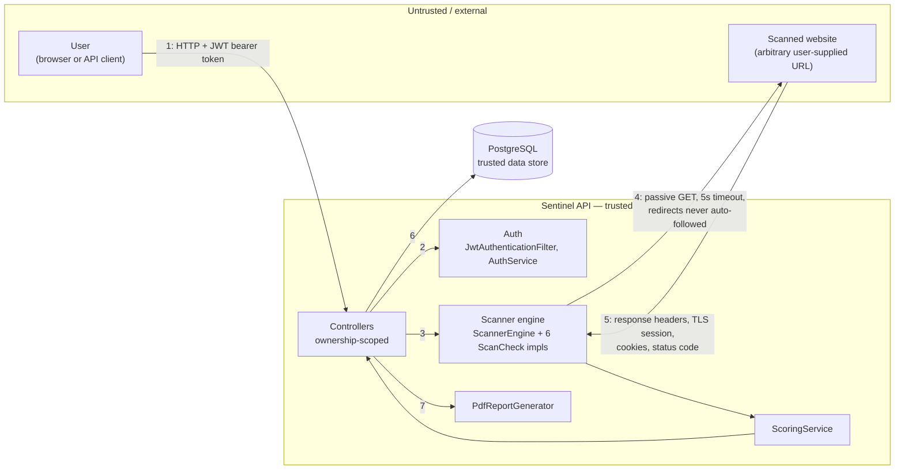

# Sentinel Threat Model

**Status:** v1.0.0, written Day 15
**Methodology:** STRIDE
**Scope:** the Sentinel application as implemented through Day 14 (auth,
website management, scanner engine, scoring, scan orchestration, PDF
reporting) plus the infrastructure it currently runs on (Docker Compose,
GitHub Actions CI). Terraform/k8s (Day 18) is documentation grade and not
yet a live deployment target, so it is out of scope here and will be
revisited once it is.

This document is not a one-time checklist. It is meant to be read
alongside `docs/SRS.md` and updated as the system changes, the same way
the SRS itself was revised after Day 11 and Day 12 resolved open
questions.

## 1. Purpose

STRIDE is used to systematically walk the six threat categories
(Spoofing, Tampering, Repudiation, Information Disclosure, Denial of
Service, Elevation of Privilege) against Sentinel's actual architecture,
not a generic web app. Every threat below is checked against the real
code, not assumed. Where a threat is already mitigated, this document
says which class and why. Where it is not, that is stated plainly as an
accepted risk or a recommendation, the same honesty standard already
used in `docs/SRS.md` section 8 (the scoring engine's documented
inconclusive-vs-confirmed limitation) and section 2.6 (domain ownership
verification called out as an accepted risk rather than silently
skipped).

## 2. System overview

A registered user authenticates with a JWT, registers a website URL they
want assessed, and triggers a scan. Sentinel's own backend then acts as
an HTTP client, making passive, read-only requests to that URL, scores
the response, persists the result, and can generate a PDF report from
it. Full component, data model, and sequence diagrams already live on
the wiki's [Architecture](https://github.com/ZukoG/sentinel-secscan/wiki/Architecture)
page; this document adds a threat-focused view rather than repeating
those diagrams.

## 3. Data flow and trust boundaries

Two trust boundaries matter most here:

- **Boundary A (client to API):** the standard boundary, crossed by every
  request, guarded by `JwtAuthenticationFilter` and `SecurityConfig`.
- **Boundary B (API to scanned target):** less obvious but specific to
  this project. Sentinel itself becomes an outbound HTTP client to a URL
  that a user, not an operator, controls. This reverses the usual
  direction of trust: the "untrusted input" here is not a request body,
  it is the destination Sentinel's own server connects to. Section 5.4
  (Information Disclosure) covers this in detail, it is the most
  significant finding in this document.

## 4. Assets

| Asset | Why it matters |
|---|---|
| User passwords | Never stored in recoverable form; compromise would let an attacker impersonate a user everywhere they reuse the password. |
| JWT signing secret (`sentinel.jwt.secret`) | Anyone holding it can forge a valid token for any user id, bypassing authentication entirely. |
| User email addresses | PII, also the login identifier. |
| Registered website URLs | Can reveal what a user is auditing, which may itself be sensitive (e.g. a pre-launch site, an employer's internal tooling). |
| Scan findings and PDF reports | Describe a real site's security posture. Exposure to the wrong party turns a defensive tool into a reconnaissance aid. |
| Database contents generally | Single Postgres instance holds all of the above for every user. |
| CI/CD pipeline and build artifacts | Integrity of what actually gets built and deployed. |

## 5. STRIDE analysis

Each threat is rated with the same severity scale already used for scan
findings (`Severity`: INFO, LOW, MEDIUM, HIGH, CRITICAL), applied here to
the threat itself rather than to a finding, so the two parts of the
project stay conceptually consistent.

### 5.1 Spoofing

**S-1: Forging or stealing another user's JWT to impersonate them.**
Mitigated. Tokens are signed with HS256 (`JwtService`) and verified on
every request by `JwtAuthenticationFilter`; a tampered payload fails
signature verification and is rejected. Residual risk is LOW and depends
entirely on the signing secret staying secret (see I-2, which covers the
secret itself rather than the signing mechanism).

**S-2: Spoofing the scanned target (DNS hijack, on-path attacker between
Sentinel and the target) to produce misleading findings.** Partially
mitigated by design, not by a specific control: `SslCertificateCheck`
and `HstsCheck` inspect the actual TLS session and certificate chain
returned by the connection, and a spoofed or MITM'd endpoint presenting
an invalid or self-signed certificate causes an `SSLHandshakeException`,
which `SslCertificateCheck` reports as a HIGH finding rather than
silently trusting it. Full protection would need certificate pinning per
target, not justified for a passive assessment tool. LOW residual risk,
this is fundamentally a property of the target's own security, not
something Sentinel can fully control.

**S-3: A user registers a URL for a site they do not own or control.**
Accepted risk, already flagged in `docs/SRS.md` section 2.6 and
`Requirements.md`'s Out of Scope list. Sentinel does not verify domain
ownership in v1 (no DNS TXT record challenge, no email verification to a
domain contact). This is not primarily a threat to Sentinel's own
confidentiality or integrity, it is a misuse-of-service concern: nothing
stops a user from pointing Sentinel at a site they do not own. MEDIUM,
formalized here rather than left as a one-line SRS note. Recommended
mitigation: a DNS TXT record challenge before a website can be scanned,
tracked as future work rather than implemented today, this is a
dedicated feature in its own right, not a documentation-day fix.

### 5.2 Tampering

**T-1: Man-in-the-middle tampering with traffic between the client and
the Sentinel API.** Accepted risk at the current infrastructure stage.
`infra/docker-compose.yml` exposes the API on plain HTTP
(`8080:8080`), there is no TLS termination configured yet anywhere in
front of it. This is appropriate for local development, which is all
that exists today, but is a real gap that must be closed before any real
deployment: a reverse proxy or load balancer terminating TLS (the kind
of component Day 18's Terraform/k8s work would introduce) is required.
MEDIUM today given the local-only deployment target, would be HIGH for
any internet-facing deployment without this fix.

**T-2: SQL injection against PostgreSQL.** Mitigated. Every query in the
codebase goes through Spring Data JPA/Hibernate (`UserRepository`,
`WebsiteRepository`, `ScanRepository`, `FindingRepository`), all
parameterized, no raw string-concatenated SQL anywhere. Also covered by
CodeQL's SAST scanning in CI (Day 10), which specifically flags this
vulnerability class. Residual risk LOW.

**T-3: One user tampering with another user's website, scan, or finding
records.** Mitigated structurally rather than by a permission check
bolted on afterward: every lookup is ownership-scoped at the query level
(`findByOwnerId`, `findByIdAndOwnerId`, `getEntityForOwner` in
`WebsiteService`), so a cross-owner row is never loaded in the first
place, not loaded-then-rejected. There is also no update endpoint for
scans or findings at all, once `ScanRunner` completes a scan, only the
system itself writes to those rows. Residual risk LOW.

**T-4: Supply-chain tampering via a compromised dependency or CI
action.** Partially mitigated: Trivy scans the built fat jar for known
vulnerable dependencies (Day 10, ADR 0001), CodeQL scans the source, and
GitHub Actions steps use pinned major versions. There is no additional
checksum or provenance verification beyond Maven Central's own trust
model and GitHub Actions' own action resolution, which is the accepted
industry-standard baseline for a project this size, not a gap specific
to Sentinel.

### 5.3 Repudiation

**R-1: A user denies having registered a website or triggered a scan.**
Gap, honestly stated rather than glossed over. Today's evidence is
limited to ordinary application logs (Spring Boot defaults, INFO level)
and entity timestamps (`Website.addedAt`, `Scan.startedAt`), neither of
which is a tamper-evident audit trail, and neither captures request
metadata like source IP. For a student project handling no regulated
data, this is an acceptable v1 gap rather than a blocking issue. LOW,
recorded here as a real limitation rather than treated as solved.
Recommended future work: a dedicated append-only audit log table for
security-relevant actions (login, website registration, scan trigger),
distinct from ordinary application logging.

### 5.4 Information Disclosure

**I-1: One user reading another user's scan data or reports.** Mitigated,
same mechanism as T-3: ownership-scoped queries return 404, not 403, for
a resource that exists but belongs to someone else, mirroring the
generic-login-error reasoning from Day 4 so a response never confirms or
denies another user's resource exists. Verified manually at every
relevant endpoint across Days 6, 12, 13, and 14. Residual risk LOW.

**I-2: Exposure of the JWT signing secret.** `application.properties`
resolves `sentinel.jwt.secret` from the `JWT_SECRET` environment
variable, falling back to a hardcoded value
(`dev-only-local-secret-key-do-not-use-in-production-...`) that is
explicitly labeled as dev-only in a comment directly above it. That
fallback is visible in the public repository. It is intentional and
documented, not an oversight, but it means Sentinel is secure only if
correctly configured, not secure by default: a real deployment that
forgets to set `JWT_SECRET` would silently run on a publicly known
secret, letting anyone forge a valid token for any user. MEDIUM.
Recommended mitigation: fail fast at startup if `JWT_SECRET` is unset
outside a dev profile, rather than silently falling back.

**I-3: Verbose error responses leaking stack traces or internal
details.** Checked, not assumed: `server.error.include-stacktrace` is
not set, so it uses Spring Boot's default of never including it, and
every manually-verified error response across this project (Days 4, 6,
12, 13, 14) has come back as a plain `{timestamp, status, error, path}`
body with no exception class names or stack frames. Residual risk LOW,
already effectively mitigated by the framework default combined with not
overriding it.

**I-4: Server-side request forgery via the scanner engine.** The most
significant finding in this document. A registered website URL is only
validated for well-formedness and http/https scheme
(`WebsiteService.validateUrl`); nothing resolves the hostname or rejects
private, loopback, or link-local address ranges before `ScannerEngine`
makes a real outbound request to it. A user could register a URL
pointing at internal infrastructure that the Sentinel server can reach
but the user could not directly (for example a cloud metadata endpoint,
an internal admin panel, or another container on the same Docker
network), then read back information about it indirectly through the
scan findings, the checks report status codes, headers, TLS certificate
details, and redirect chains, which is enough to fingerprint an internal
service even without seeing its actual response body. This is already
named in `Requirements.md`'s Out of Scope list ("scanning targets on
private or internal networks") and in `docs/SRS.md` section 2.6 as
something to be formalized here. HIGH: unlike S-3, this is a genuine
technical risk to infrastructure the scan target sits on, not just a
misuse-of-service concern, and it is currently unmitigated in code, not
just unverified. Recommended mitigation, not implemented today: resolve
the URL's hostname before scanning and reject any result in a private
(RFC 1918), loopback, or link-local range, re-checked per redirect hop
since `RedirectAnalysisCheck` already follows chains manually and a
malicious redirect could otherwise route around a check done only on the
original URL. This deserves its own dedicated day/issue given the
mitigation touches the scanner engine itself, not a documentation-day
fix.

**I-5: Sensitive data appearing in logs.** Confirmed no plaintext
passwords are ever logged (verified manually Day 4). JWTs travel in the
`Authorization` header, which Spring Boot does not log by default and
nothing in this codebase logs explicitly. LOW.

### 5.5 Denial of Service

**D-1: Credential-stuffing or brute-force flooding of
`/api/auth/register` or `/api/auth/login`.** Gap. Neither endpoint has
rate limiting, CAPTCHA, or account lockout after repeated failures.
MEDIUM, an accepted v1 gap given the project's scope and that both
endpoints already return the same generic response regardless of
whether an email exists (Day 4), which limits what a brute-force attempt
can actually learn even if unrestricted. Recommended future work: a
per-IP rate limit on both endpoints.

**D-2: A single user exhausting scan capacity for everyone by triggering
many scans rapidly.** Partially mitigated. `AsyncConfig`'s
`scanTaskExecutor` is a bounded pool (core 2, max 4, queue 50), so a
flood of scan triggers cannot spawn unbounded threads and take down the
whole server, worst case is a full queue delaying everyone's scans
rather than an outage. There is no additional per-user throttling on top
of that shared bound. LOW-MEDIUM residual risk, the bounded pool already
covers the worst-case failure mode (resource exhaustion), what remains
is a fairness gap rather than an availability one.

**D-3: A slow, hanging, or non-responding scan target causing a scan (or
the thread running it) to hang indefinitely.** Mitigated. Every outbound
request goes through `ScannerSupport`'s shared `HttpClient` with a fixed
5-second `REQUEST_TIMEOUT`, and `RedirectAnalysisCheck` caps chains at
10 hops specifically to prevent an unbounded or looping redirect from
hanging a scan. Residual risk LOW.

**D-4: Sentinel itself becoming a source of load against a scanned
target through repeated re-scans.** Ties back to the project's core
safety framing (NFR-1, passive-only, permanent): each individual check
is a small number of read-only requests, not a flood, but nothing
currently limits how often the same website can be re-scanned by its
owner. LOW, worth noting rather than ignoring, since a tool built to
assess security responsibly should not itself become a nuisance to the
sites it assesses. Recommended future work: a minimum interval between
scans of the same website.

### 5.6 Elevation of Privilege

**E-1: A regular user gaining administrative capability.** Not
applicable today: `Role` currently only has the `USER` value, there is
no higher privilege tier in the system yet for anyone to escalate to.
Worth revisiting if an admin role is ever added (e.g. for moderation of
S-3-style misuse), at which point this threat becomes live and needs its
own analysis.

**E-2: Tampering with a JWT's claims to assume a different user's
identity or role.** Mitigated, same control as S-1: signature
verification rejects any modified token outright, there is no
claims-trust-without-verification path anywhere in
`JwtAuthenticationFilter`. Residual risk LOW.

**E-3: Remote code execution via a malicious response from a scanned
target.** Checked directly against the actual check implementations: all
six checks (`HttpsCheck`, `SecurityHeadersCheck`, `SslCertificateCheck`,
`HstsCheck`, `CookieSecurityCheck`, `RedirectAnalysisCheck`) only read
structured, typed data off the HTTP response, status codes, header
values, the TLS session, cookie attribute strings, there is no
deserialization of response bodies and nothing from a scanned target's
response is ever executed, evaluated, or used to build a shell command
or query. `PdfReportGenerator` builds PDFs from Sentinel's own known
data (score, findings already computed), it does not parse or embed
attacker-supplied files. LOW.

## 6. Summary

| ID | Category | Threat | Status | Severity |
|---|---|---|---|---|
| S-1 | Spoofing | JWT forgery / theft | Mitigated | LOW |
| S-2 | Spoofing | Spoofed scan target (MITM/DNS) | Partially mitigated | LOW |
| S-3 | Spoofing | Scanning a site the user doesn't own | Accepted risk | MEDIUM |
| T-1 | Tampering | No TLS termination on the API today | Accepted risk (dev) | MEDIUM |
| T-2 | Tampering | SQL injection | Mitigated | LOW |
| T-3 | Tampering | Cross-user data tampering | Mitigated | LOW |
| T-4 | Tampering | Supply-chain / CI tampering | Partially mitigated | LOW |
| R-1 | Repudiation | No audit trail for user actions | Gap | LOW |
| I-1 | Info disclosure | Cross-user data exposure | Mitigated | LOW |
| I-2 | Info disclosure | Public dev JWT secret fallback | Gap | MEDIUM |
| I-3 | Info disclosure | Verbose error responses | Mitigated | LOW |
| I-4 | Info disclosure | SSRF via scanner (internal targets) | Unmitigated | HIGH |
| I-5 | Info disclosure | Sensitive data in logs | Mitigated | LOW |
| D-1 | Denial of service | No rate limiting on auth endpoints | Gap | MEDIUM |
| D-2 | Denial of service | Single user exhausting scan capacity | Partially mitigated | LOW-MEDIUM |
| D-3 | Denial of service | Hanging scan target | Mitigated | LOW |
| D-4 | Denial of service | Sentinel as a load source against targets | Gap | LOW |
| E-1 | Elevation of privilege | No admin tier to escalate to | Not applicable | — |
| E-2 | Elevation of privilege | JWT claim tampering | Mitigated | LOW |
| E-3 | Elevation of privilege | RCE via malicious scan response | Mitigated | LOW |

## 7. Recommended mitigations (future work, not implemented today)

In priority order, matching severity above:

1. **I-4, SSRF via scanner:** resolve the target hostname before
   scanning and reject private/loopback/link-local ranges, re-checked
   per redirect hop.
2. **I-2, dev JWT secret fallback:** fail startup if `JWT_SECRET` is
   unset outside a dev profile instead of silently defaulting.
3. **D-1, auth rate limiting:** per-IP rate limit on
   `/api/auth/register` and `/api/auth/login`.
4. **T-1, TLS termination:** add a reverse proxy or load balancer
   terminating TLS in front of the API before any real deployment, a
   natural fit for Day 18's Terraform/k8s work.
5. **S-3, domain ownership verification:** a DNS TXT record challenge
   before a website can be scanned.
6. **R-1, audit trail:** a dedicated append-only log of security-relevant
   actions, separate from ordinary application logs.
7. **D-4, re-scan throttling:** a minimum interval between scans of the
   same website.

None of these change the passive-only safety constraint (NFR-1); all of
them harden the platform around it.

## 8. Out of scope for this document

- Physical security of any machine running Sentinel.
- Vulnerabilities in a scanned target beyond what a passive check
  observes and reports, Sentinel assesses, it does not remediate.
- Social engineering of the developer or end users.
- Terraform/k8s infrastructure (Day 18), not yet a live deployment.
- Denial-of-service resistance of the scanned target's own
  infrastructure against traffic unrelated to Sentinel.
